# Nastavení

- **Nastavení** otevřete kliknutím na tři tečky v pravém horním rohu domovské obrazovky.

  

- Můžete přejít přímo na konkrétní záložky nastavení (např. záložka pumpy) jejím otevřením a kliknutím na Nastavení pluginu.

  

- **Podmenu** může být otevřeno kliknutím na trojúhelník pod nadpisem menu.

  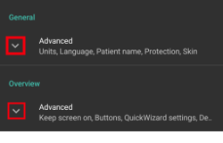

- Pomocí **filtru** v horní části obrazovky se můžete rychle dostat k nastavení, které zrovna potřebujete. Stačí začít psát část textu, který hledáte.

  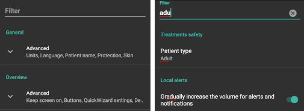

```{contents}
:backlinks: entry
:depth: 2
```

(Preferences-general)=
## Obecné

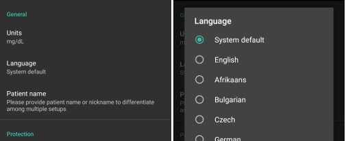

**Jednotky**

- V závislosti na vašich preferencích nastavte jednotky na mmol/l nebo mg/dl.

**Jazyk**

- Nová možnost je používat výchozí jazyk telefonu (doporučeno).

- V případě, že chcete mít AAPS v jiném jazyce než je standardní jazyk vašeho telefonu, si můžete vybrat z široké nabídky dalších jazyků aplikace.

- Pokud používáte různé jazyky, můžete se někdy setkat s jazykovým mixem. To je způsobeno problémem systému Android, kvůli které někdy přepnutí systémového jazyka nefuguje správně.


**Jméno pacienta**

- Může být použito, pokud musíte rozlišovat mezi více nastaveními (např. dvěma dětmi T1D ve vaší rodině).

(Preferences-protection)=
### Ochrana

(Preferences-master-password)=


#### Hlavní heslo

- Je nezbytné, aby bylo možné provést [export nastavení](../Usage/ExportImportSettings.md), protože jsou od verze 2.7 šifrovány. **Na OnePlus telefonech nemusí fungovat biometrická ochrana. Jedná se o známou chybu OnePlus telefonů.**

- Otevřete nastaní (tříbodové menu v právém horním rohu domovské obrazovky)

- Klepněte na trojúhelník pod "Obecné"

- Klepněte na položku "Hlavní heslo"

- Zadejte heslo, potvrďte ho, a klepněte na tlačítko Ok.

  

#### Ochrana nastavení

- Chraňte své nastavení pomocí hesla nebo biometrického ověření telefonu (např. pokud [AAPS používá dítě](../Children/Children.md)).

- Pokud chcete použít hlavní heslo pouze pro zabezpečení exportovaného nastavení \<../Usage/ExportImportSettings.md> \` \_, můžete si vytvořit Vlastní heslo.

- Pokud používáte vlastní heslo, klepněte na řádek "Nastavení hesla" a nastavte heslo tak, jak je popsáno výše [../Configuration/Preferences#master-password](Preferences-master-password).

  

#### Ochrana aplikace

- Je-li aplikace chráněna, musíte k otevření AAPS zadat heslo nebo použít biometrické ověření telefonu.
- Je-li zadáno chybné heslo, aplikace se okamžitě vypne. Pokud byla předtím úspěšně spuštěna, zůstává stále běžet na pozadí.

#### Ochrana bolusu

- Ochrana bolusu je užitečná, pokud AAPS používá malé dítě, a vy podáváte [bolus prostřednictvím SMS](../Children/SMS-Commands.md).

- V níže uvedeném příkladu vidíte výzvu k biometrické ochraně. Pokud biometrické ověření nefunguje, klepněte na místo nad bílou výzvou k zadání, a zadejte hlavní heslo.

  

(Preferences-skin)=
#### Vzhled

- Můžete si vybrat ze čtyř typů vzhledů:

  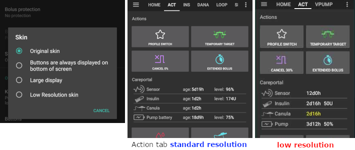

- "Vzhled pro nízké rozlišení" má kratší popisky a nezobrazuje stáří/úroveň, aby zbylo dost místa na obrazovkách s velmi malým rozlišením.

- Rozdíly mezi ostatními vzhledy závisí na orientaci telefonu.

##### Na výšku

- \*\* Původní vzhled\*\* a **Tlačítka jsou vždy zobrazena na spodní části obrazovky** jsou stejné
- **Velký displej** má v porovnání s ostatními skiny větší velikost grafů

##### Na šířku

- Při použití **Původní vzhled** a **Velký displej**, musíte posouvat dolů, abyste zobrazili tlačítka v dolní části obrazovky

- **Velký displej** má v porovnání s ostatními skiny větší velikost grafů

  

(Preferences-overview)=
## Přehled

- V sekci Přehled můžete nastavit preference pro domácí obrazovku.

  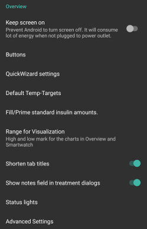

### Nechat obrazovku zapnutou

- Užitečné při předvádění.
- Tento režim spotřebovává velké množství energie, takže je nutné připojit mobil do nabíječky.

(Preferences-buttons)=
### Tlačítka

- Určete, která tlačítka se zobrazí ve spodní části domovské obrazovky.

  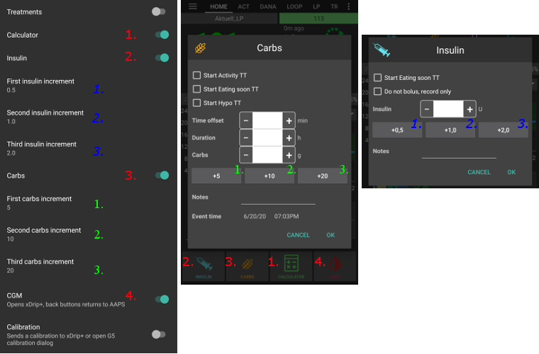

- Podle vyznačených souvislostí na obrázcích můžete nadefinovat hodnoty trlačítek sacharidů a inzulínu pro snadnější zadávání v dialogových oknech.

  

  

(Preferences-quick-wizard)=
### Průvodce rychlým bolusem

- Pokud máte často svačinu nebo jídlo, můžete použít Rychlý bolus pro snadnější vkládání hodnot sacharidů a nastavení základních výpočtů.

- V nastavení si určíte, v jakém časovém období se má tlačítko zobrazit na domácí obrazovce - právě jedno tlačítko na jedno období.

  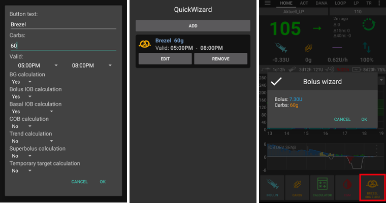

- Když kliknete na tlačítko Rychlý bolus, AAPS provede výpočty a navrhne bolus pro zadané množství sacharidů s ohledem na aktuální hodnoty (glykémie nebo aktivního inzulínu, pokud je nastaven).

- Navržený bolus musí být potvrzen, aby byl následně vydán.

  

(Preferences-default-temp-targets)=
### Výchozí nastavení dočasných cílů

- [Dočasné cíle (DC)](../Usage/temptarget.md) vám umožní nastavit na určitou dobu změněnou cílovou hodnotu glykémie.

- S nastavením základních hodnot DC můžete jednodušeji měnit své cílové hodnoty glykémie pro aktivity, blížící se jídlo atd.

  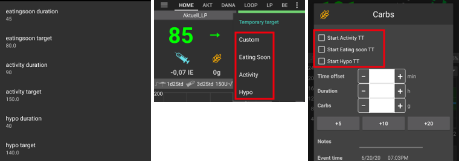

- Dlouze stiskněte cíl v pravém horním rohu domácí obrazovky nebo použijte zaškrtávací políčka v dialogu Sacharidy po kliknutí na oranžové tlačítko Sacharidy na domovské obrazovce.

  

###

### Standardní množství inzulinu pro Plnění/Doplňování

- Pokud chcete plnit hadičku nebo kanylu prostřednictvím AAPS, můžete to udělat na [záložce akce](Screenshots-action-tab).
- Přednastavené hodnoty se dají měnit v tomto dialogu.

(Preferences-range-for-visualization)=
### Rozsah zobrazování

- Určuje, jaká část grafu na domácí obrazovce bude bude vaším cílovým rozsahem a bude podbarvena zeleně.

  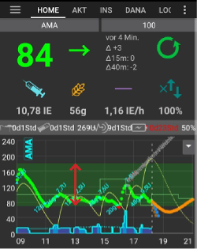

### Krátké názvy modulů

- Umožňuje vidět víc názvů obrazovek na obrazovce najednou.

- Například název "OpenAPS AMA" bude zobrazen jako "OAPS" a "NS CLIENT" jako "NSCL" atd.

  

### Zobrazovat kolonku poznámky v dialozích ošetření

- Přidává možnost doplňovat k záznamům o ošetření krátkou textovou poznámku v dialozích, kde se zadávají (Bolusová kalkulačka, Sacharidy, Inzulín...)

  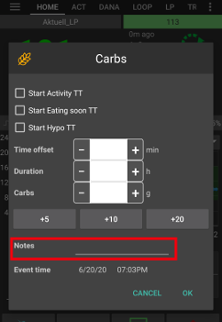

(Preferences-status-lights)=
### Stavové indikátory

- Stavové indikátory zobrazují vizuální varování pro

  - Stáří senzoru
  - Stav baterie senzoru pro určité typy čteček (viz. [snímky obrazovak](Screenshots-sensor-level-battery) pro podrobnosti).
  - Stáří inzulínu (doba použití aktuálního zásobníku)
  - Stav zásobníku (jednotky)
  - Stáří kanyly
  - Stáří baterie v pumpě
  - Úroveň nabití baterie pumpy (%)

- Pokud dojde k dosažení prahové hodnoty, zobrazí se hodnoty žlutě.

- Pokud dojde k dosažení kritické prahové hodnoty, hodnoty se zobrazí červeně.

- Ve verzích předcházejících AAPS 2.7 muselo být nastavení stavových indikátorů provedeno v nastavení Nightscoutu.

  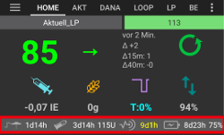

(Preferences-advanced-settings-overview)=
### Rozšířená nastavení (přehled)

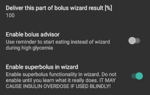

(Preferences-superbolus)=
#### Superbolus

- Volba pro povolení superbolusu v bolusové kalkulačce.
- [Superbolus](https://www.diabetesnet.com/diabetes-technology/blue-skying/super-bolus/) se používá jako prevence proti prudkému růstu glykémie po jídle, a spočívá ve "vypůjčení" bazálního inzulínu z následujících 2 hodin.

## Bezpečnostní omezení ošetření

### Typ pacienta

- Bezpečnostní limity jsou nastaveny na základě věku, který jste zvolili v tomto nastavení.
- Pokud začnete narážet na pevně nastavené limity (jako například na maximální bolus), je čas posunout se o stupeň výš.
- Nastavení vyššího než skutečného věku není dobrý nápad, protože může vést k předávkování inzulínem při chybném nastavení množství inzulínu (například vynecháním desetinné čárky v dialogu).
- Chcete-li zjistit, jaké máte pevně nastavené bezpečnostní limity, podívejte se na popis Vámi používaného algoritmu [na této stránce](../Usage/Open-APS-features.md).

### Maximální povolený bolus \[U\]

- Určuje maximální velikost bolusu, jakou může AAPS poslat najednou.
- Nastavení slouží jako bezpečnostní limit pro zabránění odeslání příliš velkého bolusu vzhledem k množství zadaných sacharidů, nebo k ohlídání chyby uživatele.
- Doporučuje se nastavit ho na rozumnou hodnotu zhruba odpovídající maximálnímu bolusu, který jste kdy poslali na jídlo.
- Toto omezení se vztahuje i na výsledky bolusové kalkulačky.

### Maximální povolené sacharidy \[g\]

- Určuje maximální množství sacharidů, se kterým může bolusový kalkulátor AAPS počítat.
- Nastavení slouží jako bezpečnostní limit pro zabránění odeslání příliš velkého bolusu vzhledem k množství zadaných sacharidů, nebo k ohlídání chyby uživatele.
- Je doporučeno nastavit limit na nějakou rozumnou hodnotu, která odpovídá maximálnímu množství sacharidů, které jste kdy v jídle snědli.

## Smyčka

(Preferences-aps-mode)=
### Typ smyčky

- Přepíná mezi uzavřenou, otevřenou smyčkou i pozastavením při nízké glykémii (LGS)
- **Otevřená smyčka** znamená, že a základě vašich dat dostanete návrhy nastavení dočasného bazálu. Po manuálním potvrzení bude příkaz pro odeslání inzulinu poslán do pumpy. Pouze v případě že máte nastavenou virtuální pumpu je nutné inzulín aplikovat ručně.
- **Uzavřená smyčka** znamená, že dočasné bazály jsou automaticky, bez jakéhokoliv potvrzení z vaší strany, posílány přímo do pumpy.
- **Ochrana před nízkou glykémií** funguje obdobně jako uzavřená smyčka, ale přepíše nastavení maxIOB na nulu. To znamená, že pokud glykémie klesá, může dojít ke snížení úrovně bazálu, ale pokud se hodnota glykémie zvyšuje, zvýší se bazál pouze v případě, pokud je IOB záporný (např. z důvodu předchozího snížení bazálu).

(Preferences-minimal-request-change)=
### Minimální změna pro výzvu \[%\]

- Při použití otevřené smyčky budete dostávat oznámení pokaždé, když AAPS doporučí úpravu bazální dávky.
- Ke snížení počtu oznámení můžete zadat buď širší rozsah cílové glykemie, nebo vyšší procento minimální změny pro výzvu.
- Toto definuje relativní změnu, která je požadována pro spuštění oznámení.

(Preferences-advanced-meal-assist-ama-or-super-micro-bolus-smb)=
## Vylepšený asistent pro jídlo (AMA) nebo Super Micro bolus (SMB)

Stavové indikátory zobrazují vizuální varování pro

- [Vylepšený asistent pro jídlo (OpenAPS AMA)](Open-APS-features-advanced-meal-assist-ama) - stav algoritmu v roce 2017
- [Super Micro Bolus (OpenAPS SMB)](Open-APS-features-super-micro-bolus-smb) - nejnovější algoritmus pro pokročilé uživatele

### Nastavení OpenAPS AMA

- Jsou-li sacharidy zadány správně, reaguje systém po bolusu na jídlo rychleji, a to díky aplikování vysoké dočasné bazální dávky.
- Více podrobností o nastavení a Autosens můžete najít v .

#### Max. U/h, které lze nastavit pro dočas. bazál

- Maximální hodnota dodatečného bazálního inzulínu (v jednotkách), o který může smyčka navýšit Váš normální bazál.
- Jakmile je tato hodnota dosažena, AAPS zastaví přidávání dodatečného bazálu, dokud hodnota inzulínu v těle (IOB) opět neklesne pod tuto hodnotu.
- Doporučuje se nastavit toto na rozumnou hodnotu. Je doporučeno vzít **nejvyšší hodnotu bazálu** v profilu a **vynásobit ji 4**.
- Například: máte-li ve svém profilu nejvyšší hodnotu bazálu 0.5U/h, dostanete po vynásobení 4 hodnotu 2U/h.
- Viz také [podrobný popis funkce](Open-APS-features-max-u-h-a-temp-basal-can-be-set-to-openaps-max-basal).

#### Maximální bazální IOB \[U\]

- získání dostatečného času na to, abyste naučili AndroidAPS ovládat a vysledovat, jak funguje.
- perfektní vyladění nastavení Vašeho bazálního profilu a faktoru citlivosti na inzulín (ISF).
- zjištění, jak AndroidAPS omezuje Váš bazální inzulín, aby se předešlo hypoglykémii.
- Tato hodnota je počítána a monitorována nezávisle na vašem normálním bazálu. V úvahu je brán pouze dodatečný bazální inzulín převyšující normální bazál.

Když začínáte se smyčkou, ** je doporučováno nastavit si na nějaký čas maximální bazální IOB na 0**, než si na systém zvyknete. Toto zabrání AndroidAPS v tom, aby přidal dodatečný bazální inzulín. Během této doby bude AndoidAPS pořád schopná omezit či vypnout Váš bazální inzulín, aby se pomohlo předejít hypoglykémii. To je důležitý krok pro:

- Začněte tedy s touto hodnotou, a postupem času ji opatrně navyšujte.
- Využijte této příležitosti k perfektnímu vyladění nastavení Vašeho bazálního profilu a faktoru citlivosti na inzulín (ISF).
- Všimněte si, jak AndroidAPS omezuje Váš bazální inzulín, aby se předešlo hypoglykémii.

Když se na to už budete cítit, můžete dovolit systému, aby začal přidávat bazální inzulín, a to navýšením hodnoty maximálního množství bazálního inzulínu v těle. Doporučuje se vzít **nejvyšší hodnotu bazálu **ve Vašem profilu a ** vynásobit ji třemi**. Například: máte-li ve svém profilu nejvyšší hodnotu bazálu 0.5U/h, dostanete po vynásobení 3 hodnotu 1.5U/h.

- [Autosens](../Usage/Open-APS-features#autosens) sleduje odchylky glukózy v krvi (pozitivní/negativní/neutrální).
- Toto jsou pouze návrhy; tělo každého člověka je jiné. Možná zjistíte, že potřebujete méně nebo více, než je zde doporučeno. Vždy ale začněte opatrně, a přidávejte pomalu.

**Poznámka: Jako bezpečnostní prvek je maximální bazální IOB natvrdo nastaveno na maximálně 7 jednotek.**

#### Autosens

- [Autosens](Open-APS-features-autosens) sleduje odchylky glukózy v krvi (pozitivní/negativní/neutrální).
- Pokud je chcete i přesto změnit, prostudujte si podrobnosti v , abyste pochopili, co děláte.
- Pokud vyberete "Autosens také nastavuje cíl", bude algoritmus upravovat i vaši cílovou hodnotu glykémie.

#### Pokročilé nastavení (OpenAPS AMA)

- Obvykle v tomto dialogu není potřeba měnit žádná nastavení!
- Pokud je chcete přesto změnit, ujistěte se, že jste si přečetli podrobnosti v [dokumentaci OpenAPS](https://openaps.readthedocs.io/en/latest/docs/While%20You%20Wait%20For%20Gear/preferences-and-safety-settings.html#) a rozmíte tomu, co děláte.

(Preferences-openaps-smb-settings)=
### Nastavení OpenAPS SMB

- Na rozdíl od AMA, [SMB](Open-APS-features-super-micro-bolus-smb) nevyužívá ke řízení hodnoty glykémie dočasné úrovně bazálu, ale především velmi malé bolusové dávky (mikrobolusy).

- Použití SMB je možné až po spuštění [9. cíle](Objectives-objective-9-enabling-additional-oref1-features-for-daytime-use-such-as-super-micro-bolus-smb).

- První tři nastavení jsou vysvětleny [výše](Preferences-max-u-h-a-temp-basal-can-be-set-to-openaps-max-basal).

- Podrobnosti o různých možnostech nastavení jsou popsány v části [Funkce OpenAPS](Open-APS-features-enable-smb).

- *Jak často budou SMB podávány v min.* je omezení SMB, které je standardně nastaveno na každé 4 minuty. Tato hodnota brání systému vydávat SMB příliš často (např. v případě nastavení dočasného cíle). Toto nastavení byste neměli změnit, pokud přesně nevíte, jaké mohou být následky.

- Pokud je aktivováno 'Sensitivita zvýší cíl" nebo 'Resistance sníží cíl', [Autosens](Open-APS-features-autosens) změní váš glykemický cíl podle odchylek hodnoty glykémie.

- Je-li cíl upraven, bude na domovské obrazovce zobrazen se zeleným pozadím.

  

(Preferences-carb-required-notification)=
#### Oznámení vyžadovaných sacharidů

- Tato funkce je k dispozici pouze v případě, je-i vybrán algoritmus SMB.

- V případě že referenční design detekuje potřebu sacharidů, navrhe konzumaci dalších sacharidů.

- V tomto případě obdržíte oznámení, které může být odloženo na 5, 15 nebo 30 minut.

- Kromě toho se na domovské obrazovce v sekci COB zobrazí požadované sacharidy.

- Je možné nastavit prahovou hodnotu - minimální počet sacharidů potřebný ke spuštění oznámení.

- V případě potřeby může být notifikace vyžadovaných sacharidů odeslána do Nightscoutu. Notifikace se pak zobrazí v Nightscoutu a bude vysílána.

  

#### Pokročilé nastavení (OpenAPS AMA)

- Obvykle v tomto dialogu není potřeba měnit žádná nastavení!
- Pokud je chcete přesto změnit, ujistěte se, že jste si přečetli podrobnosti v [dokumentaci OpenAPS](https://openaps.readthedocs.io/en/latest/docs/While%20You%20Wait%20For%20Gear/preferences-and-safety-settings.html#) a rozmíte tomu, co děláte.

## Nastavení absorpce sacharidů


### min_5m_carbimpact

- Algoritmus používá BGI (vliv na glukózu v krvi) k určení, kdy jsou absorbovány sacharidy.

- Tato hodnota se používá pouze při výpadcích hodnot odečítaných z CGM nebo v případech, kdy se fyzickou aktivitou vyrovná vzestup glykémie, který by jinak vedl k tomu, že by systém AAPS odbourával COB.

- V situacích, kdy absorpci sacharidů nelze počítat dynamicky na základě reakcí vaší glykémie, je použita výchozí hodnota absorpce. V podstatě jde o bezpečnostní pojistku.

- Zjednodušeně řečeno: algoritnuls ví jak by se *měla* vaše glykémie chovat, je-li ovlivněna podaným inzulínem apod.

- Kdykoli dojde k pozitivní odchylce od očekávaného chování, je rozloženo/absorbováno určité množství sacharidů. Velká změna = více sacharidů atp.

- Hodnota min_5m_carbimpact definuje výchozí vliv absorpce sacharidů za 5 minut. Více informací naleznete v [dokumentaci OpenAPS](https://openaps.readthedocs.io/en/latest/docs/While%20You%20Wait%20For%20Gear/preferences-and-safety-settings.html?highlight=carbimpact#min-5m-carbimpact).

- Standardní hodnota pro AMA je 5, pro SMB 8.

- Graf COB na domovské obrazovce označuje kdy se používá min_5m_impact tím, že se na vrcholu zobrazí oranžový kroužek.

  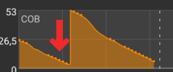

### Max. doba absorpce sacharidů

- Pokud často jíte jídla s vysokým obsahem tuků nebo bílkovin, budete si muset nastavit delší čas absorpce jídla.

### Pokročilé nastavení - autosens ratio

- Definujte min. a max. poměr [autosens](Open-APS-features-autosens).
- Normálně by se neměly měnit standardní hodnoty (max. 1.2 a min. 0.7).

## Nastavení pumpy

Možnosti se budou lišit v závislosti na tom, který ovladač pumpy jste vybrali v [Config builderu](Config-Builder-pump).  Spárujte a nastavte svou pumpu podle pokynů pro jednotlivé pumpy:

- [Inzulinová pumpa DanaR](../Configuration/DanaR-Insulin-Pump.md)
- [Inzulinová pumpa DanaRS](../Configuration/DanaRS-Insulin-Pump.md)
- [Pumpa Accu-Chek Combo](../Configuration/Accu-Chek-Combo-Pump.md)
- [Pumpa Accu-Chek Insight](../Configuration/Accu-Chek-Insight-Pump.md)
- [Pumpa Medtronic](../Configuration/MedtronicPump.md)

Pokud používáte AAPS pro otevřenou smyčku, ujistěte se, že jste v konfiguraci zvolili virtuální pumpu.

(Preferences-nsclient)=
## NSClient

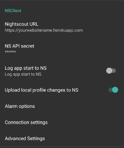

Původní komunikační protokol, lze použít se staršími verzemi Nightscoutu.

- Nastavte svou *Nightscout URL* (tj. <https://yoursitename.yourplaform.dom>).
  - **Ujistěte se, že adresa URL na konci NEOBSAHUJE /api/v1/.**
- *[API secret](https://nightscout.github.io/nightscout/setup_variables/#api-secret-nightscout-password)* (12 znakové heslo zaznamenané v proměnných Nightscoutu).
- Toto umožní zápis i čtení dat mezi Nightscoutem a AAPS.
- Větší množství SSID lze oddělit středníkem.

## NSClientV3


[Nový protokol byl zaveden s AAPS 3.2.](../Installing-AndroidAPS/Releasenotes.md#important-comments-on-using-v3-versus-v1-api-for-nightscout-with-aaps) je bezpečnější a efektivnější.

:::{admonition} V3 data uploaders
:class: warning Pokud používáte NSClientV3, všechna zařízení musí používat API V3. Protože většina z nich ještě není kompatibilní, znamená to, že **musíte nechat AAPS nahrát všechna data** (glykémie, ošetření, . .) do Nightscoutu a zakázat nahrávání všem ostatním zařízením, pokud nejsou v kompatibilní s V3.  
:::

- Nastavte svou *Nightscout URL* (tj. <https://yoursitename.yourplaform.dom>).
  - **Ujistěte se, že adresa URL na konci NEOBSAHUJE /api/v1/.**
- V Nightscoutu vytvořte *[Admin token](https://nightscout.github.io/nightscout/security/#create-a-token)* (vyžaduje [Nightscout v. 15](https://nightscout.github.io/update/update/) pro použití V3 API) a zadejte jej do **NS přístupový token** (nikoli vaše API Secret!).
- Toto umožní zápis i čtení dat mezi Nightscoutem a AAPS.
- Větší množství SSID lze oddělit středníkem.
- Ponechte připojení k websocketům povolené (doporučeno).

### Synchronizace

Možnosti synchronizace budou záviset na tom, jak chcete používat AAPS.

Můžete vybrat, která data chcete [nahrávat a stahovat do nebo z Nightscoutu](../Installing-AndroidAPS/Nightscout.md#aaps-settings).

### Nastavení alarmů


- Nastavení alarmů umožňují vybrat, jaké alarmy Nightscoutu se mají v aplikaci používat. AAPS spustí alarm, když se zapne alarm na Nightscout.
  - Aby alarmy fungovaly, je třeba nastavit v [Nightscoutu variables](https://nightscout.github.io/nightscout/setup_variables/#alarms) hodnoty glykémie pro Urgentní, Vysokou, Nízkou a Urgentní nízkou glykémii.
  - Budou fungovat pouze v případě že budete mít připojení k Nightscoutu, a jsou určeny pro rodiče/pečovatele.
  - Pokud máte zdroj CGM na svém telefonu (tj. xDrip+ nebo BYODA), použijte tyto alarmy místo alarmů Nightscout.
- Vytvářejte oznámení z [Nightscout oznámení](https://nightscout.github.io/nightscout/discover/#announcement), aby se ukázaly v oznamovacím panelu AAPS.
- Můžete nastavit Mezní hodnotu pro zastaralá data a Urgentní mezní hodnotu pro zastaralá data. Tato nastavení spustí alarm pokud po určenou dobu nejsou přijata žádná data z Nightscoutu.

### Nastavení připojení

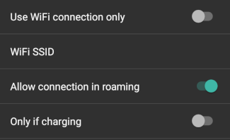

- Nastavení připojení definují, kdy bude povoleno připojení k Nightscoutu.
- Volby alarmu umožňují vybrat, jaké výchozí alarmy Nightscoutu se mají v aplikaci používat.
- Chcete-li používat pouze konkrétní síť Wi-Fi, můžete zadat její WiFi SSID.
- Budou fungovat pouze v případě že budete mít připojení k Nightscoutu, a jsou určeny pro rodiče/pečovatele.
- Chcete-li smazat všechna SSID, nechejte pole prázdné.

(Preferences-advanced-settings-nsclient)=
### Rozšířená nastavení (NSClient)


Možnosti v pokročilém nastavení jsou samovysvětlující.

## SMS komunikátor

- Možnosti se zobrazí pouze v případě, že je v [Konfiguraci](Config-Builder-sms-communicator) vybrán SMS komunikátor.
- Používat zjištění polohy podle sítě: Poloha podle vaší Wi-Fi sítě
- Podrobnější informace jsou popsány v sekci [SMS příkazy](../Children/SMS-Commands.md).
- Dodatečná bezpečnost je zajištěna použitím autentizační aplikace a dodatečného PIN na konci tokenu.

## Automatizace

Vyberte, jaká služba určování polohy se použije:

- Používat pasivní polohu: AAPS zjistí polohu pouze v případě, že ji budou požadovat ostatní aplikace
- Používat zjištění polohy podle sítě: Poloha podle vaší Wi-Fi sítě
- Používat GPS polohu (Pozor! Může způsobovat nadměrné vybíjení baterie!)

## Místní výstrahy

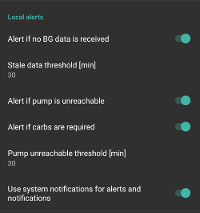

- Můžete pomáhat s vývojem AAPS zasláním hlášení o pádu vývojářům.

## Možnosti dat


- Můžete pomáhat s vývojem AAPS zasláním hlášení o pádu vývojářům.

## Nastavení údržby


- Standardně logy přijímáme na adrese <logs@androidaps.org>.
- Pokud vyberete *Zašifrovat exportovaná nastavení*, budou zašifrována vaším [hlavním heslem](Preferences-master-password). V tomto případě je nutné při každém exportu nebo importu nastavení zadat hlavní heslo.

## Open Humans

- Můžete pomoci komunitě tím, že daruje vaše data do výzkumných projektů! Podrobnosti jsou popsány na stránce [Open Humans](../Configuration/OpenHumans.md).

- V předvolbách můžete definovat, kdy budou data odeslána

  - pouze v případě připojení k WiFi
  - pouze při nabíjení
